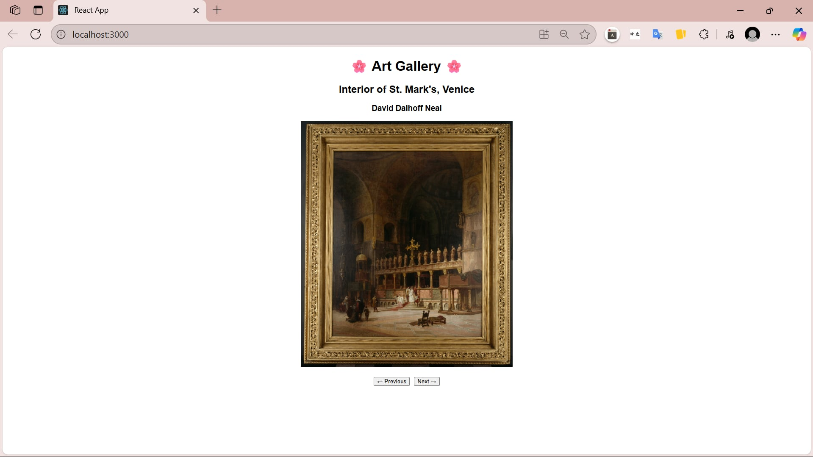
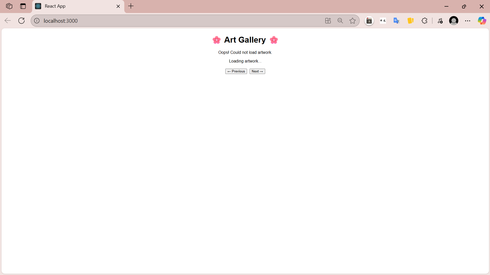

# 🎨 Artwork Display Application

A full-stack web application that displays artwork from the Art Institute of Chicago's public API with navigation capabilities and comprehensive testing coverage.

## 📋 Table of Contents
- [Features](#features)
- [Tech Stack](#tech-stack)
- [Getting Started](#getting-started)
- [API Integration](#api-integration)
- [Testing Strategy](#testing-strategy)
- [Screenshots](#screenshots)  
- [Known Issues](#known-issues)
- [Future Enhancements](#future-enhancements)

## ✨ Features

- **Artwork Display:** View artwork with title, artist, and high-quality images
- **Navigation:** Browse through artworks using Previous/Next buttons
- **Smart ID Handling:** Automatically skips invalid artwork IDs
- **Error Handling:** Graceful handling of missing images and API failures
- **Responsive Design:** Clean, centered layout that works on different screen sizes
- **External API Integration:** Fetches real artwork data from Art Institute of Chicago

## 🛠 Tech Stack

### Frontend
- **React** - UI framework
- **JavaScript (ES6+)** - Programming language
- **HTML/CSS** - Styling and structure

### Backend
- **Spring Boot** - Java framework
- **Java** - Programming language
- **REST API** - Communication protocol

### External API
- **Art Institute of Chicago API** - Artwork data source

### Testing
- **Manual Testing** - 22 comprehensive test cases
- **JUnit 5** - Unit testing framework
- **Mockito** - Mocking framework
- **Selenium WebDriver** - UI automation
- **TestNG** - Test execution framework
- **Postman** - API testing
- **Newman CLI** - API test automation

## 🚀 Getting Started

### Prerequisites
- **Java 11+**
- **Node.js 14+**
- **Maven**

### Installation

1. **Clone the repository**
   ```bash
   git clone https://github.com/hothuyhien/artwork-display.git
   cd artwork-display
   ```

2. **Start the Backend**
   ```bash
   cd backend
   mvn spring-boot:run
   ```
   Backend will run on `http://localhost:8080`

3. **Start the Frontend**
   ```bash
   cd frontend
   npm install
   npm start
   ```
   Frontend will run on `http://localhost:3000`

4. **Open your browser**
   Navigate to `http://localhost:3000` to view the application

## 🌐 API Integration

### Internal API Endpoints
- `GET /api/artwork` - Get current artwork
- `GET /api/artwork/next` - Get next artwork
- `GET /api/artwork/previous` - Get previous artwork  
- `POST /api/artwork/{id}` - Jump to specific artwork ID

### External API
- **Art Institute of Chicago API:** `https://api.artic.edu/api/v1/artworks/{id}`
- **Features:** Automatic invalid ID skipping, image URL construction, error handling

## 🧪 Testing Strategy

### [Manual Tests – Excel Format](./art-gallery-tests.xlsx) (22 Test Cases) 
- **Initial App Load:** Default artwork loading, navigation behavior
- **Navigation Testing:** Next/Previous button functionality, edge cases
- **API Integration:** External API response validation, error handling
- **Backend Testing:** REST endpoint validation, JSON structure verification

### Automated Testing
- [Unit Tests](artworks-backend/src/test/java/org/example/ArtGalleryTest.java) (JUnit 5 + Mockito)
- [UI Automation](artworks-backend/src/test/java/org/selenium/tests/DisplayTest.java) (Selenium + TestNG)
- [API Testing](https://www.postman.com/aerospace-astronomer-86846751/my-workspace/collection/pbtu2hh/artwork-display?action=share&creator=35574247) (Postman + Newman)

### Test Results
- ✅ **Passed:** 18/22 manual test cases
- ❌ **Failed:** 4 test cases (documented issues)
- 🔧 **Unit Tests:** 7+ test methods with 100% service layer coverage
- 🤖 **UI Automation:** 3 automated test scenarios
- 📡 **API Tests:** Complete collection with conditional assertions

## 📸 Screenshots

### Main Interface

*Main artwork display with navigation buttons*

### Error Handling

*Error handling when backend down*

## 🐛 Known Issues

1. **Missing Image Placeholder:** No fallback image displayed when artwork has no image
2. **API Edge Cases:** Some API responses return 200 OK with empty data instead of proper 404 errors

## 🚀 Future Enhancements

- [ ] **Search Functionality:** Allow users to search for specific artworks
- [ ] **Favorites System:** Save favorite artworks locally
- [ ] **Randomization:** Navigate to a random artwork
- [ ] **Image Optimization:** Implement lazy loading and different image sizes
- [ ] **Performance:** Add caching for frequently accessed artworks

## 🤝 Contributing

This is a personal learning project, but feedback and suggestions are welcome!

## 📄 License

This project is for educational purposes only.

## 📞 Contact

**Ho Thuy Hien**  
📧 hothuyhien2412@gmail.com  
🔗 [LinkedIn Profile]  
💻 [GitHub Profile](https://github.com/hothuyhien)

---

**Project Duration:** June 2025 - Present  
**Purpose:** Learning full-stack development and comprehensive testing methodologies
